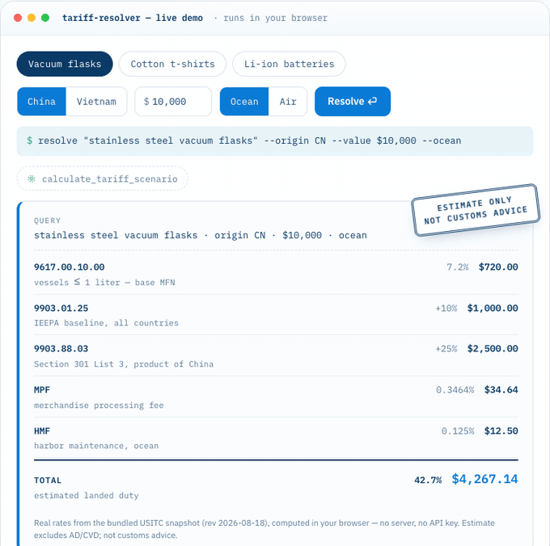

# tariff-resolver

[](https://www.npmjs.com/package/tariff-resolver)
[](https://github.com/opsloft/tariff-resolver/actions/workflows/ci.yml)
[](https://github.com/opsloft/tariff-resolver/actions/workflows/ci.yml)
[](https://www.npmjs.com/package/tariff-resolver)
[](https://www.npmjs.com/package/tariff-resolver)
[](https://registry.modelcontextprotocol.io/v0/servers?search=tariff-resolver)
[](./LICENSE)

An MCP server that turns your AI assistant into a **US import duty research tool** — built on official USITC Harmonized Tariff Schedule data (US Government public domain, 35,000+ tariff lines).

- 🔍 **HTS code candidates** from plain product descriptions, with CBP CROSS ruling links
- 🧮 **Landed-cost components**: MFN/FTA base rates + Chapter 99 additional duties (IEEPA / Section 301 / 232) + MPF/HMF fees
- 📡 **Tariff change tracking**: watchlist your HTS codes, diff rates between HTS revisions
- 🤖 **AI-optimized, hallucination-resistant**: returns the *actual* Chapter 99 rule text with parsed rates, so your LLM reasons over real exception chains instead of inventing 2024-era numbers



Why now: since the de minimis exemption ended (Aug 29, 2025), **every US-bound shipment needs an HTS code and duty payment** — and 2025–26 rates keep changing by executive order.

**Not affiliated with any government agency. Outputs are candidates/estimates for pre-broker screening — not customs, legal, or tax advice. Estimates exclude AD/CVD duties.**

## Install

Requires Node.js ≥ 18.

```bash
claude mcp add tariff-resolver -- npx -y tariff-resolver
```

Or in any MCP client config:

```json
{ "mcpServers": { "tariff-resolver": { "command": "npx", "args": ["-y", "tariff-resolver"] } } }
```

## 💡 Try these prompts

- **Basic search:** *"Find the HTS code for a men's 100% cotton t-shirt."*
- **Full scenario:** *"Calculate the tariff scenario for HTS 6109.10.00, origin China, customs value $5,000, ocean freight."*
- **Sourcing decision:** *"I'm importing $10k of stainless steel vacuum flasks. Compare landed cost if I source from China vs Vietnam."*
- **Stay current:** *"Watch tariff changes for my catalog: 6109.10.00, 8507.60.00, 9617.00.10."*

## Tools

| Tool | What it does |
|---|---|
| `search_hs_candidates` | Product description → top HTS candidates with rates + CBP CROSS ruling links |
| `calculate_tariff_scenario` | HTS code + origin + value (+ weight) → structured JSON: base MFN/FTA rate, **active** Chapter 99 rules (footnote-linked / origin-matched / universal, terminated rules filtered), MPF/HMF |
| `watch_tariff_changes` | Register HTS codes to a local watchlist |
| `check_tariff_updates` | Diff current vs previous HTS revision — see exactly which rates changed |
| `dataset_info` | Data revision date, row counts, source, license |

## Design

The server does the **retrieval**; your LLM does the reasoning. Chapter 99 rules are returned verbatim (with parsed `adder_pct` where applicable) so the model reads the actual exception chains instead of trusting a black-box calculation. Rates for 10-digit statistical suffixes inherit from their parent rate line. Terminated provisions are filtered out and counted.

## Data

Ships with a full HTS snapshot, fetched from USITC's official JSON API (US Government public domain). Refresh anytime:

```bash
python3 scripts/fetch_hts.py   # ~2 min, fails hard rather than write a partial dataset
```

`dataset_info` reports the revision date your queries run against.

## License

MIT. Tariff data is a work of the US Government (public domain).
